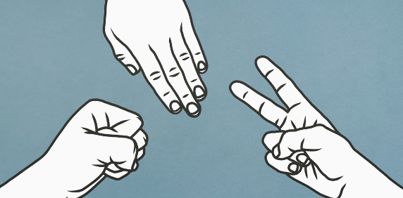

# Computer Vision RPS
Rock-Paper-Scissors is a game in which each player simultaneously shows one of three hand signals representing rock, paper, or scissors. Rock beats scissors. Scissors beats paper. Paper beats rock. The player who shows the first option that beats the other player's option wins. This is an implementation of an interactive Rock-Paper-Scissors game, in which the user can play with the computer using the camera.

## Milestone 1-3
- Created an image project model with four different classes: Rock, Paper, Scissors, Nothing from Teachable-Machine
- Downloaded the keras model after training on the website

### Setting up Env
- `conda create -n tensorflow-env python=3.9`
- `conda activate tensorflow-env`
- `conda install pip`
- install from 'https://developer.apple.com/metal/tensorflow-plugin/'
- `conda install -c conda-forge opencv`
- `conda install ipykernel`
- list of requirements is stored in `requirements.txt` by `pip list > requirements.txt`
- User can install the dependencies by running `pip install requirements.txt`
- note: the model takes a long time to run and kept printing predictions - need to ask later

## Milestone 4
- Create a simple Rock-Paper-Scissors game in `manual_rps.py`
- `get_computer_choice` randomly selects rock, paper, scissors
- `get_user_choice` asks user for an input
- `get_winner` compares the computer choice and user choice and determine a winner and print the corresponding winning, losing, or tie messages
- `play` simulates the game

## Milestone 5
- Using the camera to play rock-paper-scissors in `camera_rps.py`
- `get_machine_output()` functions gets the machine prediction
    - Inplemented a 3 second timer with `time.time()` in `get_machine_output()`
- `get_predictions()` transforms the machine output from `get_machine_output()` to either 'Rock', 'Paper', or 'Scissors'
- `get_winner()` determines the winner of the game by comparing the computer random choice and the user input choice using the camera
- `game()` repeats game until a player has won 3 times, logic as follows:
    - each player start with score 0, if a person wins, score is increased by 1
    - game will continue until a person has reached 3 points. 